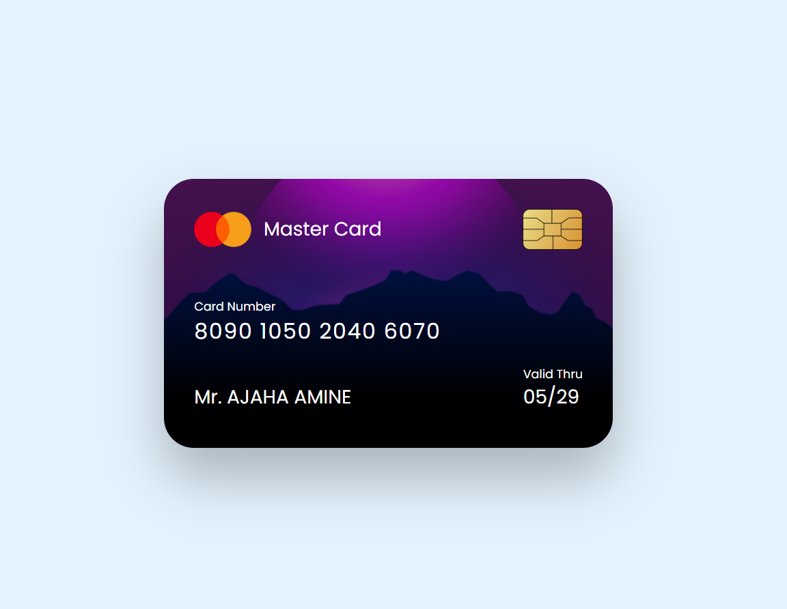

# Credit Card Project



A simple and responsive credit card UI built using HTML and CSS.

## Features

- Responsive design
- Modern and clean UI
- Hover and focus effects

## Technologies Used

- HTML5
- CSS3 (Flexbox & Grid)

## How to Use

1. Clone the repository:  
   ```sh
   git clone https://github.com/Amine4jh/credit-card-project.git
   ```

2. Open index.html in your browser.
